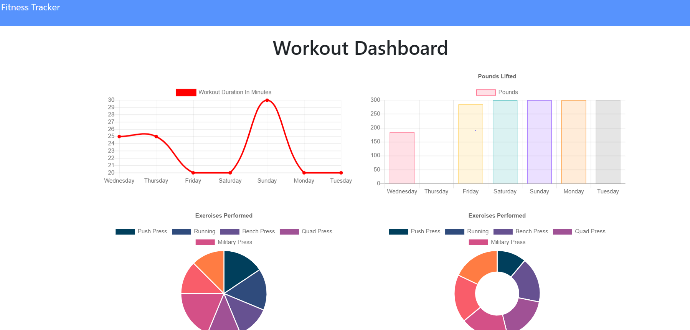

# workout_tracker
fitness tracker using mongoDB and mongoose

  ## Description
  DB and Mongoose, create a workout tracker for stats to be entered and compiled into a stats sheet

  * [Installation](#installation)
  * [Technology](#technology)
  * [Success](#success)
  * [Holdbacks](#holdbacks)
  * [Contribution](#contribution)
  * [Test](#test)
  * [License](#license)
  * [Questions](#questions)
  

## Installation
none

## Technology
Mongo DB, Mongoose, html, css, js

## Success
With most of my projects, I find that I start of very strong and get stuck in the mid to late stages. I felt i got my model and base routes and server file completed very quickly.

## Holdbacks
As stated above, the mid to late areas of the assignment are what caught me off guard. My study group worked out some kinks we had regarding the model so that fixed some of my issues. I used the tutoring session on wednesday to get a better understanding of the aggregate request as it was a little complex for me. After seeing it broken down and implementing in my code, the final piece of code to write was much easier as i now understood it. All in all, not a massively difficult or time consuming project but one that used alot of concepts that needed to be researched.

## Contribution
Starting code for all front end was given. Model and routes files created by me

## Test
no testing 

## License 

## Questions
If you have fursther questions, you can reach me at
[Github](https://github.com/Jarred-Caris)
or
jarred.caris@gmail.com

[click for heroku domain] (https://dashboard.heroku.com/apps/aqueous-reef-40105/deploy/heroku-git)

[click for URL] (https://jarred-caris.github.io/Tech_blog/)